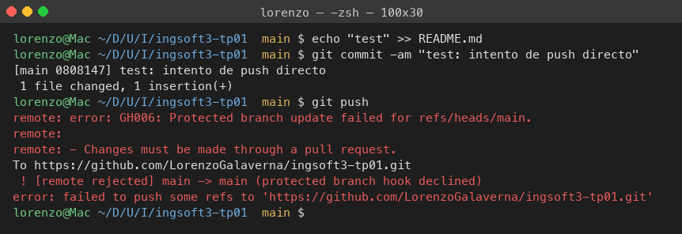
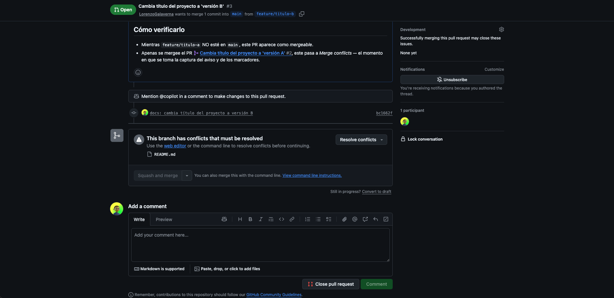
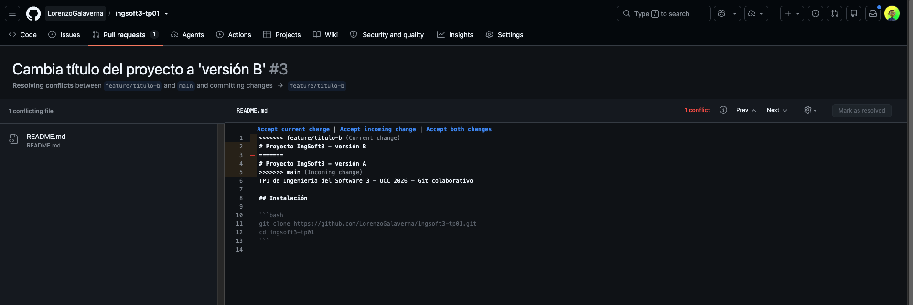
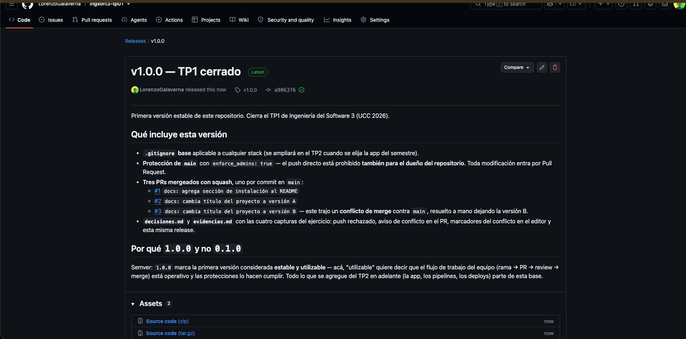

# Evidencias — TP1

Las cuatro capturas marcadas 📸 en la guía, tomadas en el momento en que ocurrió cada hecho. Tres de las cuatro son irrepetibles: el aviso de conflicto y el editor con los marcadores dejan de existir en cuanto el conflicto se resuelve, y la release solo se publica una vez.

---

## 1. Push directo a `main` rechazado



Salida real de la terminal, con `main` ya protegida. Se hizo un commit local (`0808147`) y se intentó `git push`. Git empaquetó y transmitió los objetos —hasta ahí todo funciona—, y el rechazo llegó **del lado del servidor**:

```
remote: error: GH006: Protected branch update failed for refs/heads/main.
remote:
remote: - Changes must be made through a pull request.
 ! [remote rejected] main -> main (protected branch hook declined)
error: failed to push some refs to 'https://github.com/LorenzoGalaverna/ingsoft3-tp01.git'
```

Lo importante no es que rechazó: es **a quién** rechazó. Quien empujó es el dueño del repositorio. La protección se creó con *Do not allow bypassing the above settings* (equivalente por API: `enforce_admins: true`), así que la regla lo alcanza igual. Una protección que el administrador puede saltear no protege nada: protege mientras nadie tenga apuro.

Después de capturar, el commit local se descartó con `git reset --hard HEAD~1`; nunca existió en el remoto.

---

## 2. El PR de la rama B no se puede mergear: conflicto



Pull Request [#3](https://github.com/LorenzoGalaverna/ingsoft3-tp01/pull/3) (`feature/titulo-b` → `main`), sacada inmediatamente después de mergear el PR [#2](https://github.com/LorenzoGalaverna/ingsoft3-tp01/pull/2) (`feature/titulo-a`). Se ve el cartel **"This branch has conflicts that must be resolved"** con `README.md` como único archivo afectado, la sugerencia de usar el editor web (o la línea de comandos) y el botón **Squash and merge** deshabilitado.

El detalle que vale la pena mirar: **hasta un minuto antes, este mismo PR figuraba como mergeable.** Las dos ramas habían nacido del mismo commit de `main` (`7a9ba74`, el del PR #1) y reescribieron la misma primera línea del `README.md`, pero mientras ninguna de las dos estuviera integrada no había nada que chocara. El conflicto no nace cuando se escribe el cambio: nace cuando se lo intenta integrar contra un `main` que ya se movió.

La confirmación por API antes de sacar la captura:

```json
{"mergeStateStatus":"DIRTY","mergeable":"CONFLICTING"}
```

---

## 3. Los marcadores del conflicto



Editor de conflictos de GitHub (`/pull/3/conflicts`), **antes de tocar nada**. Ahí están las tres fronteras que deja Git cuando no puede decidir:

```
<<<<<<< feature/titulo-b   (Current change)
# Proyecto IngSoft3 - versión B
=======
# Proyecto IngSoft3 - versión A
>>>>>>> main               (Incoming change)
```

Arriba de `=======` está la versión de la rama actual (`feature/titulo-b`), abajo la que ya está en `main` después del PR #2. Arriba a la derecha se lee **1 conflict** y el botón **Mark as resolved** está deshabilitado: GitHub no deja marcar el archivo como resuelto mientras quede un solo marcador.

Y lo que **no** está en conflicto es igual de informativo: las líneas 6 a 13 —la sección `## Instalación` que venía del PR #1— aparecen limpias, sin marcadores. Ninguna de las dos ramas las tocó, así que Git las fusionó solo, sin preguntar. El conflicto es quirúrgico: cae sobre la línea disputada, no sobre el archivo entero.

Esta captura es la más frágil de las cuatro, porque el paso inmediatamente siguiente es borrar esos marcadores para resolver el conflicto.

---

## 4. La release `v1.0.0` publicada



Release `v1.0.0` con el badge **Latest**, apuntando al tag `v1.0.0` y al commit `a906376` — la punta de `main` después de mergear los tres PRs. Las notas explican qué incluye la versión y justifican por qué el número es `1.0.0` y no `0.1.0` (semver: primera versión estable y utilizable).

El tag se creó **anotado** desde la máquina (`git tag -a v1.0.0 -m "..."` seguido de `git push origin v1.0.0`) y la release se publicó sobre ese tag ya existente. Un tag anotado es un objeto de Git con autor, fecha y mensaje propios (`fa0b8c6`); un tag liviano sería solo un puntero sin metadatos. Para marcar una entrega, el anotado es el que corresponde.
