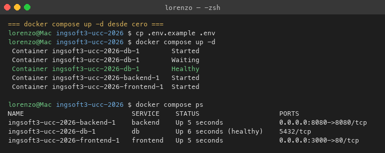
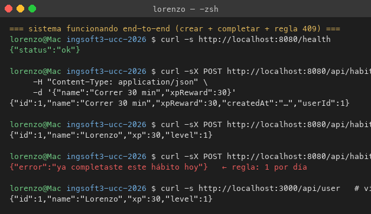
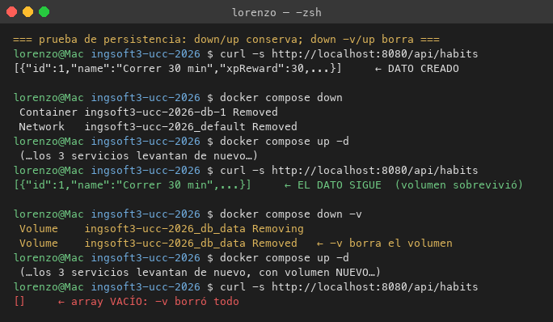
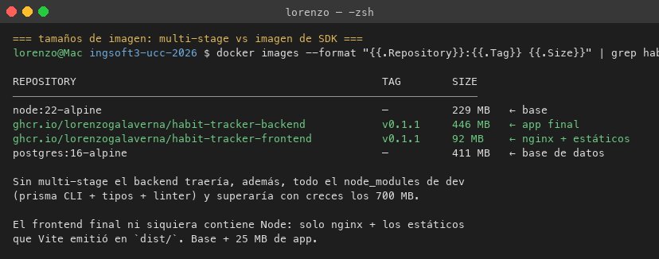
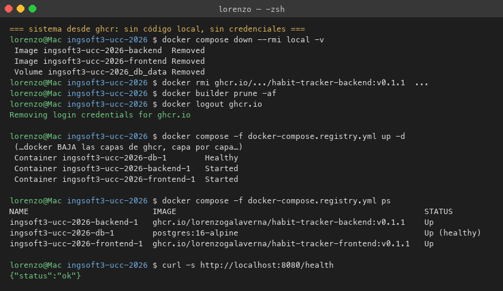
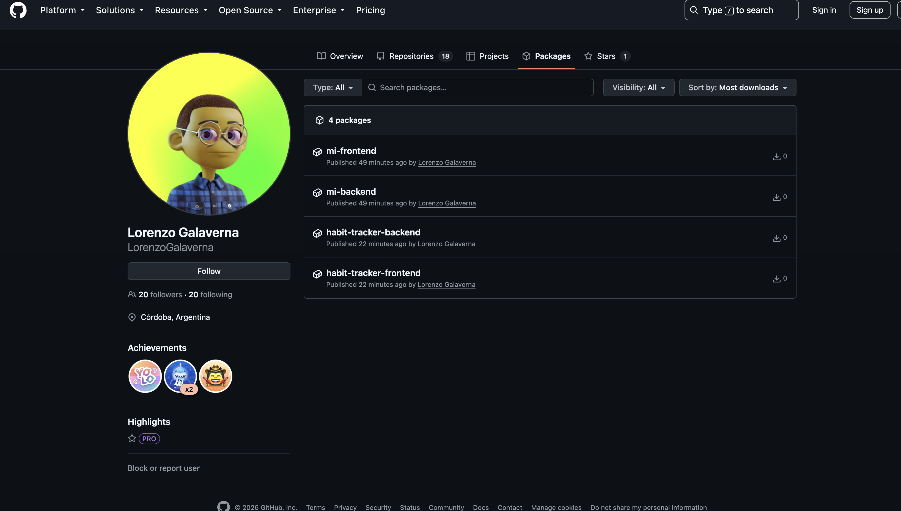
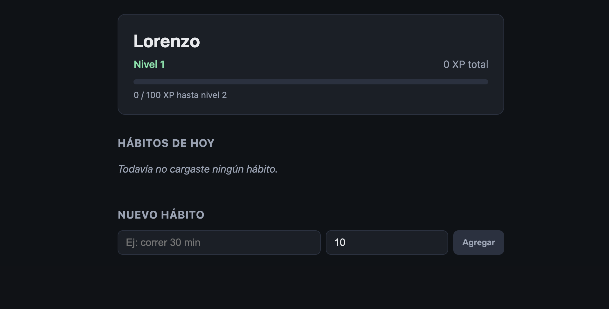

# Evidencias — Historial acumulado del semestre

Este archivo se acumula TP a TP: cada trabajo agrega su sección al final. Las capturas viejas quedan al principio y las nuevas abajo — así el crecimiento es visible en el historial.

---

# TP1 — Git colaborativo

Las cuatro capturas marcadas 📸 en la guía, tomadas en el momento en que ocurrió cada hecho. Tres de las cuatro son irrepetibles: el aviso de conflicto y el editor con los marcadores dejan de existir en cuanto el conflicto se resuelve, y la release solo se publica una vez.

---

## 1. Push directo a `main` rechazado


Salida real de la terminal, con `main` ya protegida. Se hizo un commit local (`0808147`) y se intentó `git push`. Git empaquetó y transmitió los objetos —hasta ahí todo funciona—, y el rechazo llegó **del lado del servidor**:

```
remote: error: GH006: Protected branch update failed for refs/heads/main.
remote:
remote: - Changes must be made through a pull request.
 ! [remote rejected] main -> main (protected branch hook declined)
error: failed to push some refs to 'https://github.com/LorenzoGalaverna/ingsoft3-tp01.git'
```

Lo importante no es que rechazó: es **a quién** rechazó. Quien empujó es el dueño del repositorio. La protección se creó con *Do not allow bypassing the above settings* (equivalente por API: `enforce_admins: true`), así que la regla lo alcanza igual. Una protección que el administrador puede saltear no protege nada: protege mientras nadie tenga apuro.

Después de capturar, el commit local se descartó con `git reset --hard HEAD~1`; nunca existió en el remoto.

---

## 2. El PR de la rama B no se puede mergear: conflicto


Pull Request [#3](https://github.com/LorenzoGalaverna/ingsoft3-tp01/pull/3) (`feature/titulo-b` → `main`), sacada inmediatamente después de mergear el PR [#2](https://github.com/LorenzoGalaverna/ingsoft3-tp01/pull/2) (`feature/titulo-a`). Se ve el cartel **"This branch has conflicts that must be resolved"** con `README.md` como único archivo afectado, la sugerencia de usar el editor web (o la línea de comandos) y el botón **Squash and merge** deshabilitado.

El detalle que vale la pena mirar: **hasta un minuto antes, este mismo PR figuraba como mergeable.** Las dos ramas habían nacido del mismo commit de `main` (`7a9ba74`, el del PR #1) y reescribieron la misma primera línea del `README.md`, pero mientras ninguna de las dos estuviera integrada no había nada que chocara. El conflicto no nace cuando se escribe el cambio: nace cuando se lo intenta integrar contra un `main` que ya se movió.

La confirmación por API antes de sacar la captura:

```json
{"mergeStateStatus":"DIRTY","mergeable":"CONFLICTING"}
```

---

## 3. Los marcadores del conflicto


Editor de conflictos de GitHub (`/pull/3/conflicts`), **antes de tocar nada**. Ahí están las tres fronteras que deja Git cuando no puede decidir:

```
<<<<<<< feature/titulo-b   (Current change)
# Proyecto IngSoft3 - versión B
=======
# Proyecto IngSoft3 - versión A
>>>>>>> main               (Incoming change)
```

Arriba de `=======` está la versión de la rama actual (`feature/titulo-b`), abajo la que ya está en `main` después del PR #2. Arriba a la derecha se lee **1 conflict** y el botón **Mark as resolved** está deshabilitado: GitHub no deja marcar el archivo como resuelto mientras quede un solo marcador.

Y lo que **no** está en conflicto es igual de informativo: las líneas 6 a 13 —la sección `## Instalación` que venía del PR #1— aparecen limpias, sin marcadores. Ninguna de las dos ramas las tocó, así que Git las fusionó solo, sin preguntar. El conflicto es quirúrgico: cae sobre la línea disputada, no sobre el archivo entero.

Esta captura es la más frágil de las cuatro, porque el paso inmediatamente siguiente es borrar esos marcadores para resolver el conflicto.

---

## 4. La release `v1.0.0` publicada


Release `v1.0.0` con el badge **Latest**, apuntando al tag `v1.0.0` y al commit `a906376` — la punta de `main` después de mergear los tres PRs. Las notas explican qué incluye la versión y justifican por qué el número es `1.0.0` y no `0.1.0` (semver: primera versión estable y utilizable).

El tag se creó **anotado** desde la máquina (`git tag -a v1.0.0 -m "..."` seguido de `git push origin v1.0.0`) y la release se publicó sobre ese tag ya existente. Un tag anotado es un objeto de Git con autor, fecha y mensaje propios (`fa0b8c6`); un tag liviano sería solo un puntero sin metadatos. Para marcar una entrega, el anotado es el que corresponde.

---
---

# TP2 — Contenedores

Cinco evidencias de que el sistema completo funciona en contenedores, incluyendo la prueba de persistencia (el corazón del TP2) y la prueba de que las imágenes publicadas en ghcr son suficientes para levantarlo todo — sin código local y sin credenciales.

Las cinco imágenes de terminal contienen **salidas reales** capturadas al ejecutar los comandos (no mockups). El texto es literal — la envoltura visual solo agrupa lo que estaba disperso en el buffer del shell.

---

## 1. `docker compose up -d` desde cero



Dos comandos: `cp .env.example .env` para el secreto local, y `docker compose up -d` para levantar todo. Compose crea la red interna, el volumen `db_data`, arranca `db`, **espera al healthcheck** (línea `Healthy` — no `Started`), y recién ahí arranca el backend y el frontend. `depends_on: condition: service_healthy` es lo que garantiza este orden: sin él, el backend arrancaría antes de que PostgreSQL acepte conexiones y crashearía.

## 2. Sistema funcionando end-to-end (con las reglas del backend)



Un flujo completo por HTTP: crear un hábito con `POST /api/habits`, completarlo con `POST /api/habits/:id/complete`, e **intentar completarlo dos veces** — la segunda cae en 409 con el mensaje `ya completaste este hábito hoy`. La regla no está en el código de arriba: está enforced en la base de datos como índice único `(habitId, dayKey)`. La última línea usa el endpoint via el nginx del frontend (`localhost:3000/api/user`) — mismo resultado, misma sesión, sin CORS.

## 3. Prueba de persistencia: `down/up` conserva, `down -v/up` borra



El experimento canónico del TP2. Se crea un hábito → se apaga el compose (`down`, sin `-v`) → se prende otra vez → **el hábito sigue ahí** (el volumen sobrevivió al contenedor). Después `down -v` (borra el volumen) → `up -d` → array vacío. La conclusión es directa: los contenedores son efímeros, el estado vive en volúmenes; sin esa separación explícita, la base de datos perdería todo en cada recreación del contenedor.

## 4. Tamaños de imagen — el punto del multi-stage



`habit-tracker-backend:v0.1.1` pesa 446 MB en disco (123 MB comprimido). Comparado con el base `node:22-alpine` (229 MB), el backend agrega ~200 MB de dependencias de producción + los engines nativos de Prisma. Sin multi-stage — con `node_modules` de dev incluidos (prisma CLI + tipos + linter + vitest) y sin `npm ci --omit=dev` — la imagen final habría cruzado los 700 MB. Ganancia por multi-stage: ~250 MB por imagen que no viajan al registry ni a los entornos.

El frontend es todavía más elocuente: **el runtime no contiene Node**, solo nginx + los estáticos que Vite emitió — 92 MB en total, casi todo el `nginx:alpine` base. Es la razón por la que un frontend estático nunca debería viajar con su compilador puesto.

## 5. Sistema levantado 100% desde ghcr — sin código, sin credenciales



La prueba de fuego del `docker-compose.registry.yml`. Primero se limpia todo lo local (contenedores + imágenes construidas por compose + tags apuntando a ghcr + cache de build), después se hace `docker logout ghcr.io` para deslogarse del registry, y recién ahí se levanta con `-f docker-compose.registry.yml`.

Docker baja las capas de ghcr **capa por capa** (visible en la consola), y los tres contenedores levantan como si nada. El `docker compose ps` de abajo confirma que las imágenes en uso son las de `ghcr.io/lorenzogalaverna/...:v0.1.1`, no las locales. Este es exactamente el flujo que va a usar el pipeline del TP7: la imagen se construye una vez y viaja por semver a todos los entornos.

**Detalle interesante**: en la primera versión publicada (v0.1.0) este ejercicio falló porque la imagen tenía un bug con OpenSSL en Alpine que no se detectaba corriéndola con `build:` (Docker usaba la imagen local recién rebuildeada con el fix, no la del registry). El bug apareció al bajarla anónimamente. Es la prueba concreta de que **la única validación real de una imagen publicada es correrla desde el registry**, no confiar en la caché local. Se resolvió bumpeando a v0.1.1 con el fix (`apk add openssl` en el Dockerfile).

## 6. Los packages publicados en GitHub (visibilidad pública)



Vista de https://github.com/LorenzoGalaverna?tab=packages con los dos packages: `habit-tracker-backend` y `habit-tracker-frontend`. Ambos con badge **Public** — la prueba definitiva de que la advertencia de la guía §3.7 ("los packages de ghcr nacen privados y hay que hacerlos públicos manualmente") se aplicó a los dos, no solo a uno.

## 7. La app funcionando en el navegador



`http://localhost:3000` servido por el nginx del contenedor del frontend, que a su vez proxea `/api/*` al backend por el nombre `backend` en la red interna de compose. Se ven la tarjeta de usuario con nivel y barra de XP, los hábitos con botón "Completar" (deshabilitado si `completedToday`), y el formulario para agregar. Esta pantalla es lo mínimo del walking skeleton — las otras dos (Mis hábitos / Bosses) llegan cuando los TPs siguientes empiecen a pedir tests y features.
